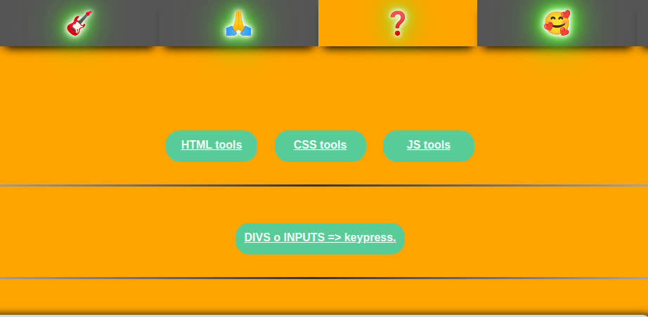
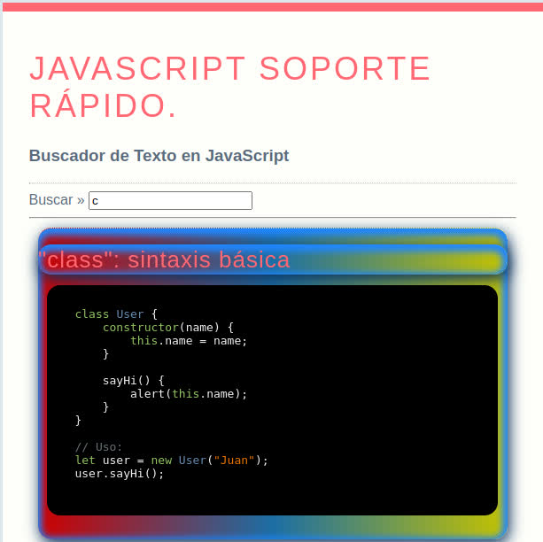
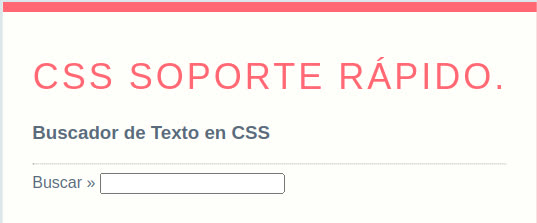
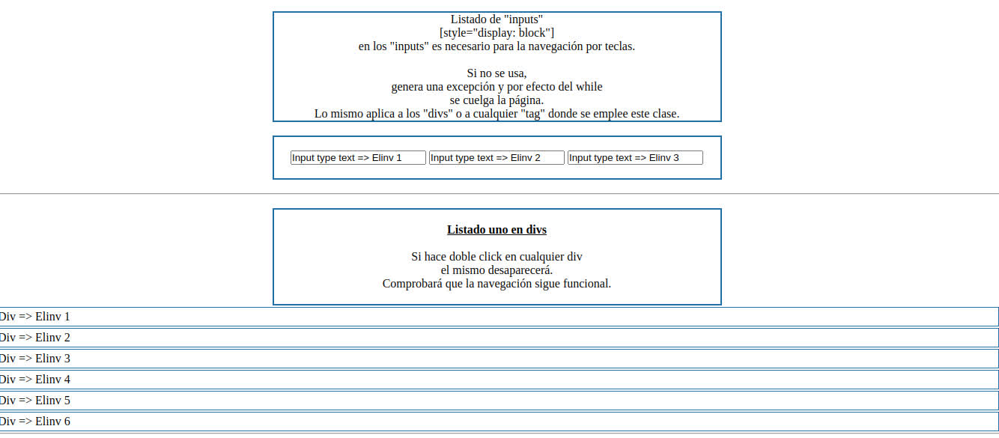
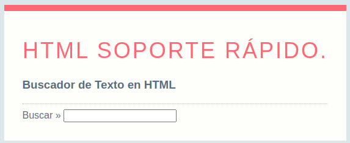

## POPURRI de código JS, con una misma aplicación
## versión JQUERY, JS PURO y JS CLASS.
## 🧐 Elinv <a name = "Elinv"></a>
----------------------------------------
<p align="center">
  <a href="" rel="noopener">
 </a>
</p>

## 🏁 Iniciemos ⛏️
----------------------------------------
```
Un popurri de archivos 
que he estado ensayando 
en estos días. 

Navegar en div y en inputs 
a través de 
los eventos del teclado. 

Base de datos web 
sin nada mas que HTML y JAVASCRIPT. 

Como buscar en la página web.
```
## Todo en funcionamiento en estos links

[Web Elinv: elinv.musica.ar](https://elinv.musica.ar/)

[Javascript Database códigos útiles](https://elinv.musica.ar/soft/popurri-keypress-nav-database-in-div-search-in-web/html_css_js_help/js.html)

[CSS Database códigos útiles](https://elinv.musica.ar/soft/popurri-keypress-nav-database-in-div-search-in-web/html_css_js_help/css.html)

[HTML Database códigos útiles](https://elinv.musica.ar/soft/popurri-keypress-nav-database-in-div-search-in-web/html_css_js_help/html.html)

[Keypress nav in div and inputs](https://elinv.musica.ar/soft/popurri-keypress-nav-database-in-div-search-in-web/js_keypress_nav/)

<br>
<p align="center">
  <a href="" rel="noopener">
 </a>
</p>

<p align="center">
  <a href="" rel="noopener">
 </a>
</p>

<p align="center">
  <a href="" rel="noopener">
 </a>
</p>

<p align="center">
  <a href="" rel="noopener">
 </a>
</p>


## Saludos y bendiciones!
----------------------------------------
# Mail [elinv.elinv@gmail.com]()
- Cualquier duda que tengan la dirigen a elinv.elinv@gmail.com.

-  🛠️ Errores, sugerencias, ideas, envialas a nuestro mail: <elinv.elinv@gmail.com>

- Ver info de Elinv en Google Search: <br>
<a href="https://www.google.com.ar/search?q=elinv">
   Enlace a la info de Elinv  -> en Google Search
</a>


- 👍 Saludos!

- Atte.

# Elinv.

